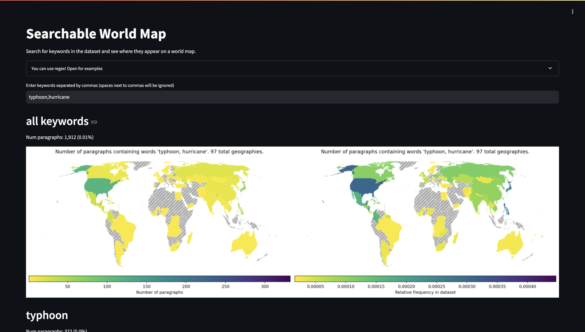

# Streamlit apps

## Searchable World Map

A demonstration of plotting maps using Climate Policy Radar data. This app allows you to compare the relative use of different keywords in this data across the world.

